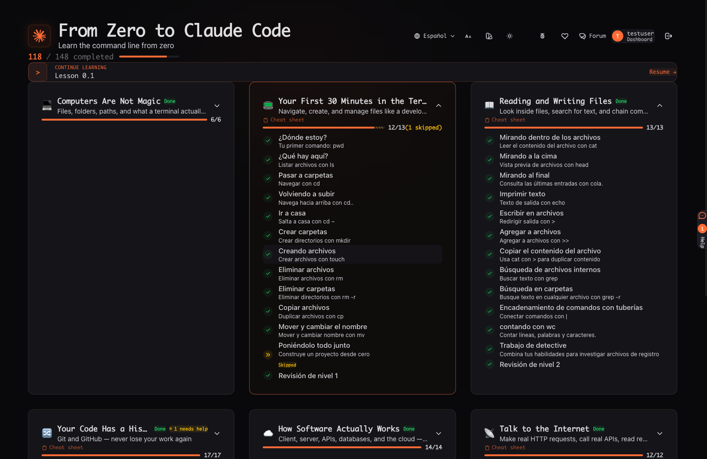
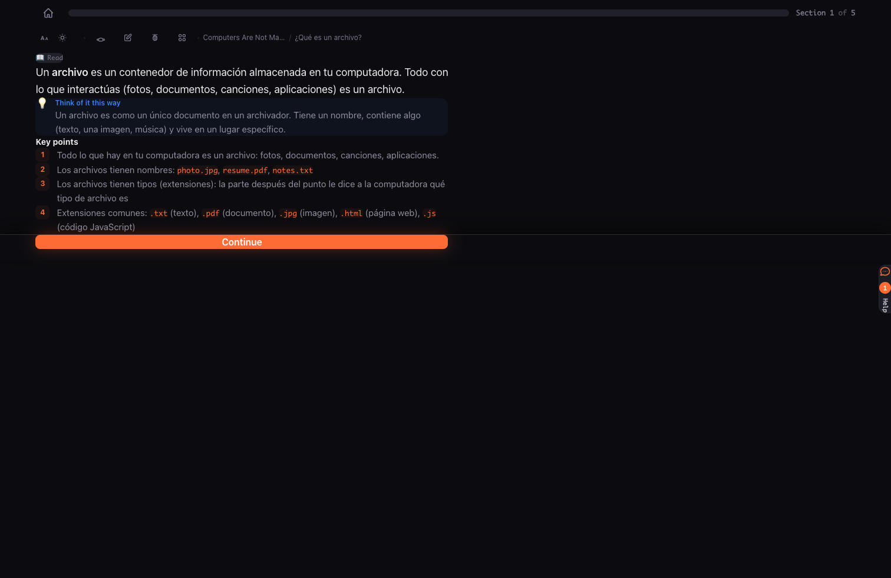
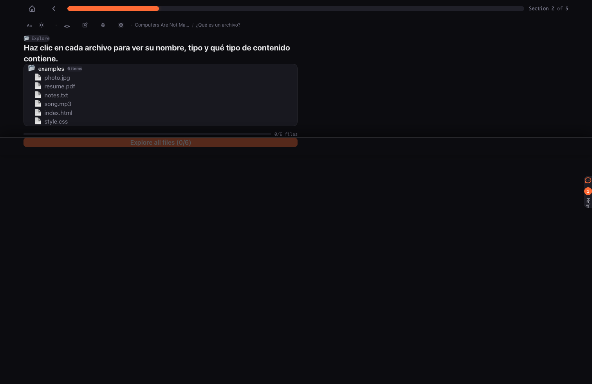
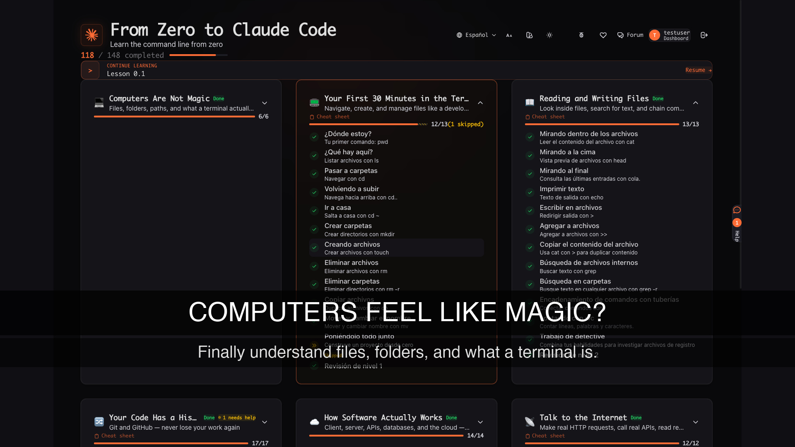

# videogen

Autonomous social video clip generator. Point it at a product URL, and it browses the page, captures screenshots, writes a script, and composes a short video with transitions and effects.

## Demo

https://github.com/user-attachments/assets/demo.mp4

### Screenshots captured by the AI agent

| Dashboard | Lesson | Interactive |
|-----------|--------|-------------|
|  |  |  |

### Generated frame with text overlay



## Setup

Requires Python 3.11+ and FFmpeg.

```bash
python3.13 -m venv .venv
source .venv/bin/activate
pip install -e .
```

Copy `.env.example` to `.env` and set your `GOOGLE_API_KEY`.

## CLI Usage

```bash
# Basic — generate a vertical video from a landing page
videogen "https://example.com"

# Landscape mode — full screenshots without cropping (1920x1080)
videogen "https://example.com" --landscape

# Automated login — agent fills in credentials
videogen "https://app.example.com/" \
  --login-url "https://app.example.com/login" \
  --username "user@email.com" \
  --password "secret" \
  --no-headless

# Custom browsing instructions — tell the agent what to capture
videogen "https://app.example.com/" \
  --task "Navigate to the dashboard, screenshot it, then open a lesson and screenshot the content"

# Manual login — pauses for you to log in, persists session
videogen "https://example.com" --login
```

### Options

| Flag | Description |
|------|-------------|
| `--scenes`, `-s` | Max number of scenes (default: 5) |
| `--duration`, `-d` | Duration per scene in seconds (default: 4.0) |
| `--music`, `-m` | Background music file path |
| `--output`, `-o` | Output directory |
| `--landscape` | Landscape 16:9 mode (no cropping) |
| `--headless/--no-headless` | Run browser headlessly (default: headless) |
| `--login`, `-l` | Pause for manual login |
| `--login-url` | Login page URL (enables auto-login) |
| `--username`, `-u` | Username for auto-login |
| `--password` | Password for auto-login |
| `--task`, `-t` | Custom browsing instructions for the agent |
| `--profile`, `-p` | Browser profile directory (persists sessions) |
| `--keep-tmp` | Keep temp files after generation |

## Web UI

A local web interface for managing the full pipeline:

```bash
source .venv/bin/activate
uvicorn videogen.server:app --port 8765 --app-dir src
```

Open http://localhost:8765. The UI provides:

- **Configuration panel** — URL, login credentials, browsing instructions, video settings
- **Real-time logs** — streaming pipeline output as the video generates
- **Video gallery** — browse and play all generated videos
- **Screenshots viewer** — inspect captured screenshots from the last run

## Architecture

Four-stage pipeline:

1. **Browse** (`browser.py`) — AI agent navigates the page and captures 4-8 screenshots using browser-use + Gemini
2. **Script** (`scriptwriter.py`) — Gemini generates a video script with hooks, headlines, and CTAs using structured output
3. **Assets** (`assets.py`) — Screenshots are processed into frames with text overlays (crop or fit-to-frame)
4. **Compose** (`composer.py`) — FFmpeg assembles frames into MP4 with Ken Burns effects and crossfade transitions

## Project Structure

```
src/videogen/
  cli.py           # Typer CLI entry point
  server.py        # FastAPI web UI backend
  browser.py       # AI-powered browsing and screenshot capture
  scriptwriter.py  # Gemini script generation with JSON schema
  assets.py        # Frame preparation (crop/fit, text overlays)
  composer.py      # FFmpeg video composition
  models.py        # Pydantic data models
  config.py        # Path configuration
ui/
  index.html       # Web UI frontend
tests/             # Test suite
```
